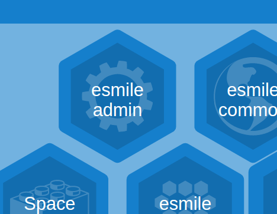

With e-smile, we wish to see more open, effective and transparent aid systems supporting sustainable and equitable development and engaging citizens not only as beneficiaries, but as actors of their own development.

Concretely, e-Smile is a series of plug-and-play applications combined together to build agile, open, coherent and contextualized information management and monitoring systems.

[see here for more information](https://www.e-smile.org/blog/e-smile/aboutE-Smile)

## Portal Application

The portal application is the main entry point for other e-smile apps.

The Portal view displays the list of installed and locally available applications. Double-click to launch the application, or access to more information by single click.

